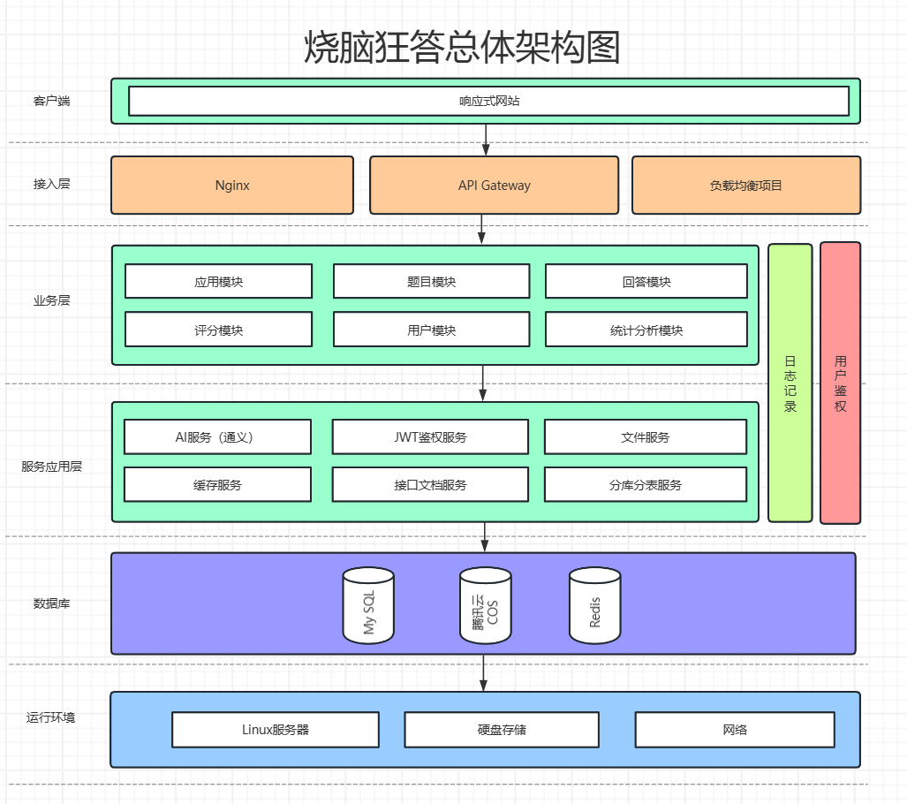

# 烧脑狂答-基于AI开发的智能微服务答题系统

## 项目简介

深入业务场景的企业级实战微服务项目，基于 Vue 3 + Spring Cloud + Open Feign + Nacos + Redis + 通义 AI + RxJava + SSE 的 **AI 答题应用平台。**

用户可以基于 AI 快速制作并发布多种答题应用，支持检索和分享应用、在线答题并基于评分算法或 AI 得到回答总结；管理员可以审核应用、集中管理整站内容，并进行统计分析。

## 项目功能

## 项目架构

